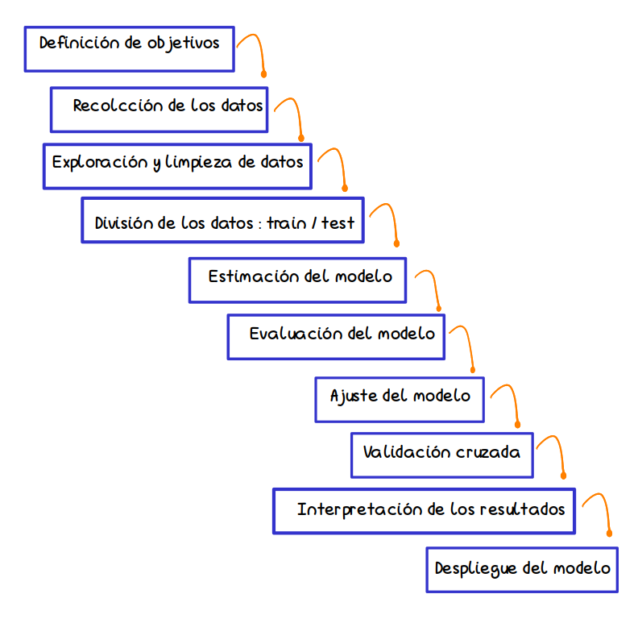

```{r setup, include=FALSE}
knitr::opts_chunk$set(echo = TRUE, comment = NA)
library(summarytools)

# colores
c1="#FF7F00"
c2="#=EB0C6"
c3="#034A94"
c4="#686868"

```

</br></br>

```{r, echo=FALSE, out.width="100%", fig.align = "center"}
knitr::include_graphics("img/banner_presentacion.png")
```

</br></br>

# <span style="color:#034A94"> **Introducción**</span>

El **modelo logit** es una poderosa herramienta de clasificación que desempeña un papel central en la ciencia de datos y permite tomar decisiones informadas y precisas en una variedad de dominios.

</br>

En esta unidad se presentan el **Modelo de Regresión Logiística binomial** :  

* Principales conceptos
* El modelo
* Estimación
* Evaluación del modelo


</br></br>

```{r, fig.align='center', message=FALSE, warning=FALSE}
library(ggplot2)
library(dplyr)

fx <- function(x) {
  1 / (1 + exp(-x))
}

# x= c(rnorm(20, -5, 5), rnorm(20, 5,5)) 
# y= rep(c(0,1), each = 20)

x= c(-3.0,  -0.1,   8.6,  -9.9, -10.2,  3.0,  -6.1,  -2.5,  -6.6, -15.3,
   -5.4,   0.9,   0.9,  -8.9, -12.7,  7.2,  5.8,  -5.4,  -2.8, -13.0,
#----------------------------------------------------------------------
    1.3,  -2.7,   -1.5,   5.5,  -1.8,  7.9,   6.4,   0.4,   6.1,   8.7,
   10.3,   3.9,   4.5 ,  -4.5,  12.2,  10.6,   9.1,   3.5,   6.8,  7.0)

y = c(0, 0, 0, 0, 0, 0, 0, 0, 0, 0, 0, 0, 0, 0, 0, 0, 0, 0, 0, 0, 
      1, 1, 1, 1, 1, 1, 1, 1, 1, 1, 1, 1, 1, 1, 1, 1, 1, 1, 1, 1)


datos <- data.frame(x, y)

ggplot(data.frame(x = c(-8, 8)), aes(x)) + 
    geom_hline(yintercept = 0, linetype = "solid", color = "#018ABE", size = 1) +
  geom_hline(yintercept = 1, linetype = "solid", color = "#018ABE", size =1 ) +
  geom_vline(xintercept = 0, linetype = "solid", color = "#686868", size =1) +
  stat_function(fun = fx, size = 1, col = "#FF7F00") +
  geom_point(data = datos, aes(x, y), color = "black", size = 1)

```


<br/><br/>

## <span style="color:#034A94">**Pasos**</span>

```{r, echo=FALSE, out.width="100%", fig.align = "center"}

```
