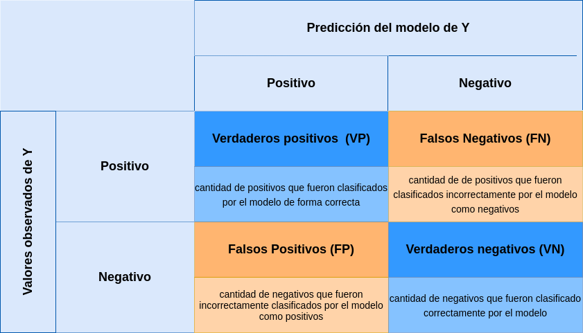
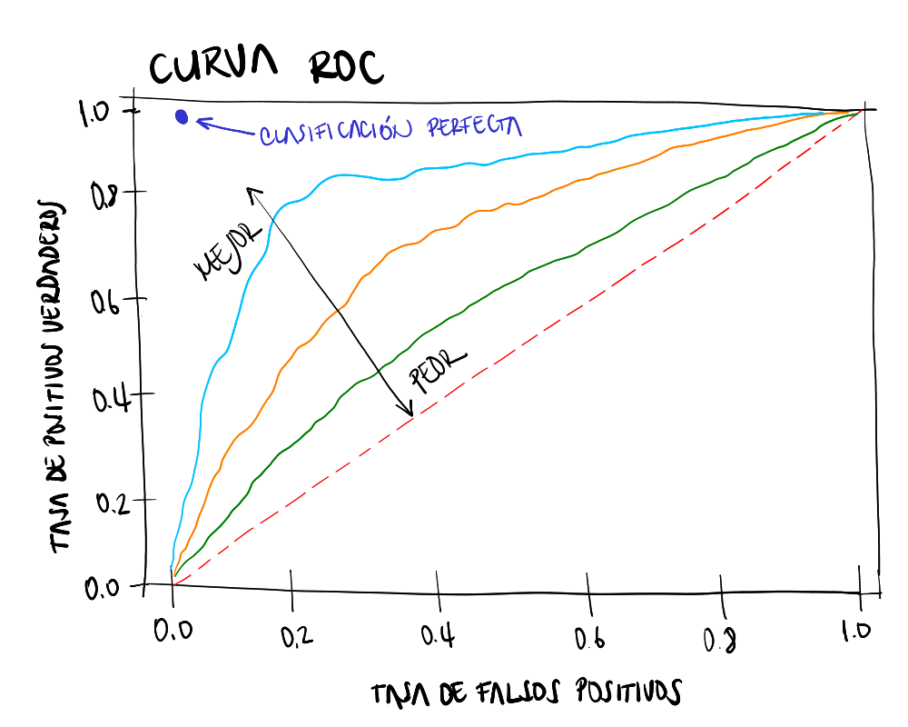
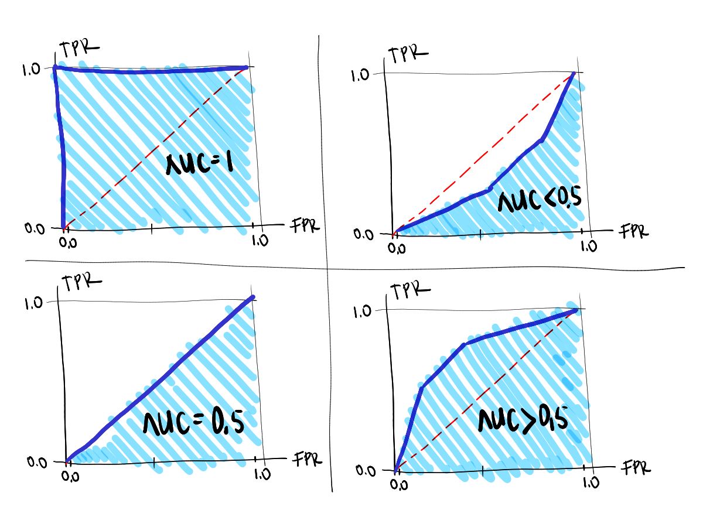

```{r setup, include=FALSE}
knitr::opts_chunk$set(comment = NA, warning = FALSE, message = FALSE)
# colores
c1="#FF7F00"
c2="#=EB0C6"
c3="#034A94"
c4="#686868"
color2=c(c1,c2)
library(memisc)
library(MASS)
library(lattice)
library(stats)
library(tidyverse)

# install.packages("learnr")          # solo una vez
# install.packages("devtools")     # solo una vez
#devtools::install_github("dgonxalex80/paqueteMOD", force = TRUE) #descarga paquete nivelatorioEST
library(paqueteMOD)
# data("dataMat")
# dataMat = sample(dataMat, 1000, replace = TRUE)
# glm(gana ~ nota , family = binomial(link = "logit"), data = dataMat) -> modelo1
# summary(modelo1) 
set.seed(123) 
data("matriculah")
matriculah = sample(matriculah, 1000, replace = TRUE)
glm(honor ~ matematicas , family = binomial(link = "logit"), data = matriculah) -> modelo1
summary(modelo1) 

```

 </br></br>

## <span style="color:#034A94">**Bondad de ajuste del modelo**</span>

</br>


</br></br>

Los colores azules representan la proporción de clasificaciones correcta :

</br>

* Siendo $No$, lo clasifica como $No$ : **VN** 

* Siendo $Si$ lo clasifica como $Si$  : **VP**

</br>

Los colores naranjas corresponden a las proporciones de clasificaciones erradas por el modelo.

* Siendo $Si$, lo clasifica incorrectamente como $No$ :  Falsos Negativo : **FN**  

* Siendo $No$, lo  clasifica incorrectamente como $Si$ : Falso Positovo  : **FP**

</br></br>

La proporción de clasificaciones correctas dan una aproximación del valor $R^2$

</br>

$$ 
\dfrac{708+115}{708+127+50+115} = \dfrac{823}{1000} = 0.823
$$
Este valor cuenta como el $R^2$ , es decir que el modelo explica (clasifica de manera adecuada) el 82.3% de los casos.

</br></br>


Este valor se puede obtener de la matriz de confusión que se obtiene con una data que no se ha empleado en la estimación del modelo

</br></br>

## <span style="color:#034A94">**Matriz de confusión**</span>

</br>

Consiste en un método de evaluación del modelo estimado, mediante la separación de la data en dos partes. Una primera para estimar el modelo (train) que puede corresponder entre el 60% y el 80% de los datos y el restante porcentaje para una muestra con la que se evalúa el poder de predicción del modelo (Test)

Lo primero será estimar el modelo con la data.train y posteriormente valuar el modelo utilizando la data.test

Con los resulados obtenidos por la predicción del modelo sobre la muestra.test se construye la matriz de confisión que tiene la siguiente forma:

</br></br>

```{r, echo=FALSE, out.width="80%", fig.align = "center"}

```


</br></br>

Se procede a dividir la data en dos partes 

* train con el 60% de los registros
* test  con el 40% de los registros

```{r, echo=FALSE}
# names(dataMat)
# nrow(dataMat)

ntrain <- nrow(matriculah)*0.6
ntest <- nrow(matriculah)*0.4
# c(ntrain,ntest)

set.seed(123)
index_train<-sample(1:nrow(matriculah),size = ntrain)
train<-matriculah[index_train,]  # muestra de entrenamiento
test<-matriculah[-index_train,]  # muestra de prueba
```

</br></br>

Se procede a estimar el modelo con la data train y luego emplearlo para realizar las predicciones con la data test, para finalmente evaluar el resultado utilizando para ello la matriz de confusión.


```{r}
library(tidyverse)
glm(honor ~ matematicas , family = binomial(link = "logit"), data = train) -> modelo2

valor_pronosticado <- predict(modelo2,test,type = "response")
niveles_pronosticados <- ifelse(valor_pronosticado >0.5, "Si","No") %>%
                             factor(.)

rendimiento_data<-data.frame(observados=test$honor,
                             predicciones= niveles_pronosticados)

Positivos <- sum(rendimiento_data$observados=="Si")
Negativos <- sum(rendimiento_data$observados=="No")
Positivos_pronosticados <- sum(rendimiento_data$predicciones=="Si")
Negativos_pronosticados <- sum(rendimiento_data$predicciones=="No")
Total <- nrow(rendimiento_data)
VP<-sum(rendimiento_data$observados=="Si" & rendimiento_data$predicciones=="Si")
VN<-sum(rendimiento_data$observados=="No" & rendimiento_data$predicciones=="No")
FP<-sum(rendimiento_data$observados=="No" & rendimiento_data$predicciones=="Si")
FN<-sum(rendimiento_data$observados=="Si" & rendimiento_data$predicciones=="No")

matriz_confusion=matrix(c(VP, FP, FN,VN), nrow=2)

rownames(matriz_confusion) = c(" Si ", " No    ")
colnames(matriz_confusion) = c("Si", "No")
matriz_confusion
```


</br></br>

<pre>
        |                predicción             |  
        |         |   Si       |    No          |
--------|---------|------------|----------------|   
Estado  |  Si     |   48  (VP) |     57   (FN)  |
real    |  No     |   23  (FP) |     272  (VN)  |
</pre>


</br>

>

A partir de la matriz de confusión se obtienen indicadores 

</br></br>

## <span style="color:#034a94">**Capacidad de clasificación del modelo**</span>

</br>

En una de las características más importantes del modelo, pues permite valorar a través de la matriz de confusión las clasificaciones correctas por medio de las predicciones del modelo. 

Existen adicionamente otros indicadores que pueden ser utilizados como es el estadistico c asociado a la curva ROC (Trvrivrt Oprtsyong Charasteristic) . Esta curva compara diferentes puntos de corte de la probabilidad que permite establecer la tasa de clasificaciones correcta de verdaderos positivos y de falsos positivos:

</br></br>


### <span style="color:#034A94"> **Exactitud**</span>

Porcentaje de casos correctamente clasificados

<div class="content-box-blue">
$$
\text{Exactitud} = \dfrac{\text{aciertos en clasificación}}{\text{Total}} = \dfrac{VP + VN}{\text{Total}} = \dfrac{48+272}{400} = 0.80
$$
</div>

</br></br>

### <span style="color:#034A94"> **Tasa de error**</span>

<!-- ```{r, echo=FALSE, out.width="80%", fig.align = "center"} -->
<!--  -->
<!-- ``` -->

Porcentaje de casos incorrectamente clasificados

<div class="content-box-blue">
$$
\text{Tasa de Error} = \dfrac{\text{no aciertos en clasificación}}{\text{Total}} = \dfrac{FP + FN}{\text{Total}} = \dfrac{23+57}{400} = 0.20
$$

</br></br>

### <span style="color:#034A94"> **Sensibilidad**</span>

Porcentaje de positivos que son clasificados por el modelo como positivos 

<div class="content-box-blue">
$$
\text{Sensibilidad} = \dfrac{VP}{\text{Total positivos}} = \dfrac{48}{105} = 0.457
$$
</div>
</br></br>

### <span style="color:#034A94"> **Especificidad**</span>

Porcentaje de negativos que son clasificados por el modelo como negativos 

<div class="content-box-blue">
$$
\text{Especificidad} = \dfrac{\text{VN}}{\text{Total negativos}} = \dfrac{272}{295} = 0.922
$$
</div>

</br></br>

### <span style="color:#034A94"> **Presición**</span> 

Porcentaje de positivos pronosticados de manera correcta


<div class="content-box-blue">
$$
\text{Precision} = \dfrac{\text{VP}}{\text{Total clasificados positivos}} = \dfrac{48}{71} = 0.676 
$$ 
</div>

</br></br>

### <span style="color:#034A94"> **Valor de predicción negativo**</span> 

Porcentaje de negativos clasificados por el modelo como negativos


<div class="content-box-blue">
$$
\text{Valor de prediccion negativo} = \dfrac{\text{VN}}{\text{Total clasificados negativos}} = \dfrac{272}{329} = 0.827 
$$ 
</div>

</br></br>


### <span style="color:#686868"> **Resumen**</span>

</br>

```{r, eval=FALSE}
library(tidyverse)
Exactitud <- (VP+VN)/Total
Tasa_de_Error <- (FP+FN)/Total
Sensibilidad <- VP/Positivos
Especificidad <- VN/Negativos
Precision <- VP/Positivos_pronosticados
Valor_prediccion_negativo <- VN / Negativos_pronosticados

indicadores <- t(data.frame(Exactitud,Tasa_de_Error,Sensibilidad,Especificidad,Precision,Valor_prediccion_negativo))
indicadores %>% 
  round(.,3)
```
<pre>
                           
Exactitud                   0.800

Tasa de Error               0.200

Sensibilidad                0.457

Especificidad               0.922

Precisión                   0.676

Valor predicción negativo   0.827

</pre>

</br></br>

<div class="content-box-gray">
### <span style="color:#686868">**Nota:**</span> 

* Interesa tener valores de 

|                            |                     |
|:--------------------------:|:-------------------:|
| Exactitud                  | alto                |
| Tasa de Error              | bajo                |
| Sensibilidad               | alto                |
| Especificidad              | alto                |
| Precisión                  | alto                |
| Valor predicción negativo  | alto                |

</br>

* El valor **c** de corte de la probabilidad, incide sobre los indicadores 

</br>

* El balanceo de los porcentajes de la variable dependiente es importante y afecta a los indicadores 

</div>


</br></br>


# <span style="color:#034A94">**Curva ROC y valor AUC**</span>

</br>

La curva ROC es una representación gráfica de los valores de 
la tasa de falsos positivos (TFP o FPR) o **1-especificidad** y en el eje de las ordenadas  la tasa de verdaderos positivos (TVP o TPR) o también llamada **sensibilidad**,  para diferentes valores del umbral de clasificación.

Esta curva permite evaluar la capacidad predictiva de un modelo de clasificación binaria (en este caso del modelo logit binomial) mediante el calculo del área bajo la curva denominado **AUC**

</br>

```{r, echo=FALSE, out.width="80%", fig.align = "center"}

```
<center>
Curvas ROC - Receiver Operating Characteristic
</center>

</br></br>


```{r, echo=FALSE, out.width="80%", fig.align = "center"}

```
<center>
Rango de valores de AUC - Area Under the Curve
</center>

</br></br>

La **clasificación perfecta** ocurre cuando la curva pasa por el punto (0,1):

* Tasa de positivos verdaderos = 1
* Tasa de falsos positivos = 0

Indicando que todos los valores positivos fueron bien clasificados como se indica en la figura (a) y corresponde a un valor AUC = 1.0


</br>

La **clasificacion excelente** se presenta cuando la curva ROC pasa cerca del punto (0,1), indicando que el modelo tienen una alta capacidad para clasificar  correctamente los valores positivos del modelo y los verdaderos negativos. En este caso el valor del área bajo la curva ROC, AUC > 0.5, representada por la figura (b)

</br>

La **clasificación aceptable** ocurre cuando el modelo presenta una capacidad limitada para clasificar y es equibalente a una asignación aleatoria. En este caso la curva ROC corresponde a una linea diagonal y el valor del area bajo la curva AUC = 0.5


</br></br>


En el caso del modelo 

$$
\widehat{\text{honor}} = \widehat{\beta_{0}} + \widehat{\beta_{1}}  \hspace{.3cm} \text{matematicas} 
$$
</br>

Presenta la curva ROC y su área bajo la curva AUC 

<center>
```{r}
library(pROC)
curva_ROC <- roc(test$honor, valor_pronosticado)
auc<- round(auc(curva_ROC, levels =c(0,1), direction = "<"),4) # 0.9177

ggroc(curva_ROC, colour = "#FF7F00", size=1)+
ggtitle(paste0("Curva ROC ", "(AUC = ", auc, ")"))+
xlab("Especificidad")+
ylab("Sensibilidad")  
```


</center>

El área comprendida entre la curva ROC y la diagonal del cuadrado  (AUC = 0.8292), indica un buen ajuste del modelo de predicción. 

</br></br>


