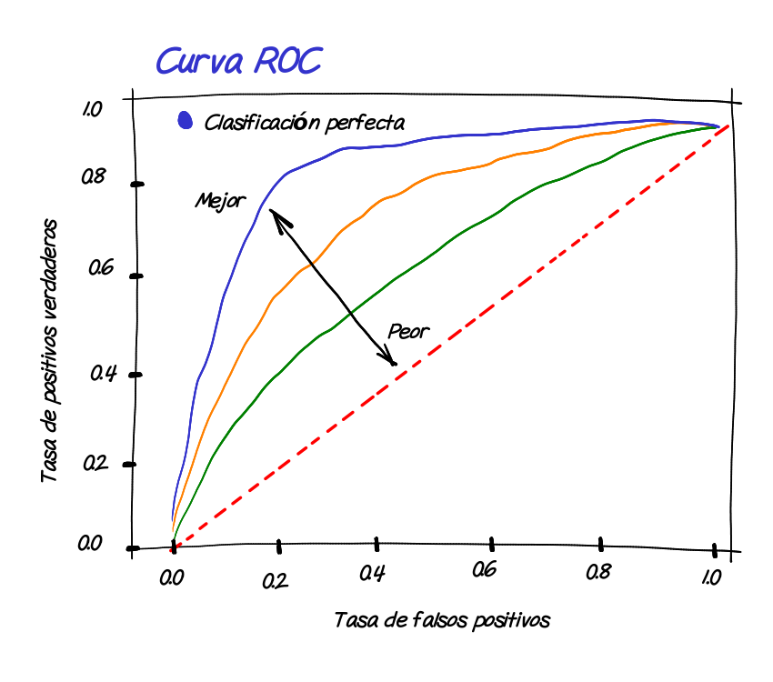

```{r setup, include=FALSE}
knitr::opts_chunk$set(comment = NA, warning = FALSE, message = FALSE)
# colores
c1="#FF7F00"
c2="#=EB0C6"
c3="#034A94"
c4="#686868"
color2=c(c1,c2)
library(memisc)
library(MASS)
library(lattice)
library(stats)
library(tidyverse)

# install.packages("learnr")          # solo una vez
# install.packages("devtools")     # solo una vez
#devtools::install_github("dgonxalex80/paqueteMOD", force = TRUE) #descarga paquete nivelatorioEST
library(paqueteMODELOS)
# data("dataMat")
# dataMat = sample(dataMat, 1000, replace = TRUE)
# glm(gana ~ nota , family = binomial(link = "logit"), data = dataMat) -> modelo1
# summary(modelo1) 
set.seed(123) 
data("matriculah")
matriculah = sample(matriculah, 1000, replace = TRUE)
modelo1 = glm(honor ~ matematicas , family = binomial(link = "logit"), data = matriculah) 
summary(modelo1) 

```

</br>

La bondad de ajuste de un modelo de **regresión logística** se mide mediante diversas métricas y pruebas estadísticas. Algunas de las formas más comunes de medir la bondad de ajuste en un modelo logit incluyen:

</br>

### <span style="color:#034a94">**Likelihood Ratio Test (Prueba de Razón de Verosimilitud)**</span>:

Esta prueba compara el modelo ajustado con un modelo nulo (modelo sin variables predictoras) para determinar si el modelo ajustado es significativamente mejor. Se utiliza el estadístico de prueba chi-cuadrado y se compara con una distribución chi-cuadrado con los grados de libertad apropiados.

</br>

### <span style="color:#034a94">**Deviance**</span>: 

La deviance es una medida de la diferencia entre el modelo ajustado y un modelo de referencia ideal. Cuanto menor sea la deviance, mejor será el ajuste del modelo. Puedes calcular la deviance utilizando la función `deviance` en R.

</br>

### <span style="color:#034a94">**AIC (Criterio de Información de Akaike)** y **BIC (Criterio de Información Bayesiano)**</span>:

Estos son criterios de selección de modelos que penalizan la complejidad del modelo. Un valor más bajo de AIC o BIC indica un mejor ajuste del modelo.

</br>

### <span style="color:#034a94">**ROC-AUC (Área bajo la Curva ROC)**</span>: 

Esta métrica mide la capacidad del modelo para discriminar entre las clases positiva y negativa. Un valor de ROC-AUC cercano a 1 indica un buen ajuste del modelo.

</br>

### <span style="color:#034a94">**Sensibilidad y Especificidad**</span>: 

Estas métricas miden la capacidad del modelo para clasificar correctamente las observaciones positivas y negativas, respectivamente. Una alta sensibilidad y especificidad indican un buen ajuste.

</br>

### <span style="color:#034a94">**Gráficos de Curva ROC y Curva PR**</span>: 

Estos gráficos te permiten visualizar el rendimiento del modelo en diferentes umbrales de probabilidad y evaluar su capacidad de clasificación.

</br>

### <span style="color:#034a94">**Matriz de Confusión**</span>: 

La matriz de confusión muestra la clasificación real y la clasificación predicha por el modelo. Puedes calcular métricas como la precisión, la tasa de falsos positivos y la tasa de falsos negativos a partir de la matriz de confusión.

</br>

### <span style="color:#034a94">**Validación Cruzada**</span>: 

Dividir los datos en **conjuntos de entrenamiento** y **conjunto de prueba** repetidamente (por ejemplo, mediante validación cruzada k-fold) y calcular métricas de bondad de ajuste en cada iteración. Esto proporciona una evaluación más robusta del modelo.

La elección de la métrica de bondad de ajuste depende de tus objetivos específicos y del contexto del problema. En general, es recomendable utilizar múltiples métricas y pruebas para evaluar el rendimiento del modelo desde diferentes perspectivas.


 </br></br>

## <span style="color:#034A94">**Bondad de ajuste del modelo**</span>

</br>


</br></br>

Los colores azules representan la proporción de clasificaciones correcta :

</br>

* Siendo $No$, lo clasifica como $No$ : **VN** 

* Siendo $Si$ lo clasifica como $Si$  : **VP**

</br>

Los colores naranjas corresponden a las proporciones de clasificaciones erradas por el modelo.

* Siendo $Si$, lo clasifica incorrectamente como $No$ :  Falsos Negativo : **FN**  

* Siendo $No$, lo  clasifica incorrectamente como $Si$ : Falso Positovo  : **FP**

</br></br>

La proporción de clasificaciones correctas dan una aproximación del valor $R^2$

</br></br>

$$ 
\dfrac{708+115}{708+127+50+115} = \dfrac{823}{1000} = 0.823
$$
</br></br>

Este valor cuenta como el $R^2$ , es decir que el modelo explica (clasifica de manera adecuada) el 82.3% de los casos.

</br></br>


Este valor se puede obtener de la matriz de confusión que se obtiene con una data que no se ha empleado en la estimación del modelo

</br></br>

## <span style="color:#034A94">**Matriz de confusión**</span>

</br>

Consiste en un método de evaluación del modelo estimado, mediante la separación de la data en dos partes. Una primera para estimar el modelo (train) que puede corresponder entre el 60% y el 80% de los datos y el restante porcentaje para una muestra con la que se evalúa el poder de predicción del modelo (Test)

Lo primero será estimar el modelo con la data.train y posteriormente valuar el modelo utilizando la data.test

Con los resulados obtenidos por la predicción del modelo sobre la muestra.test se construye la matriz de confisión que tiene la siguiente forma:

</br></br>

```{r, echo=FALSE, out.width="80%", fig.align = "center"}
knitr::include_graphics("img/matriz_confusion.png")
```


</br></br>

Se procede a dividir la data en dos partes 

* train con el 60% de los registros
* test  con el 40% de los registros

```{r}
# names(dataMat)
# nrow(dataMat)

ntrain <- nrow(matriculah)*0.6
ntest <- nrow(matriculah)*0.4
# c(ntrain,ntest)

set.seed(123)
index_train<-sample(1:nrow(matriculah),size = ntrain)
train<-matriculah[index_train,]  # muestra de entrenamiento
test<-matriculah[-index_train,]  # muestra de prueba
```

</br></br>

Se procede a estimar el modelo con la data train y luego emplearlo para realizar las predicciones con la data test, para finalmente evaluar el resultado utilizando para ello la matriz de confusión.


```{r}
library(tidyverse)
modelo2 = glm(honor ~ matematicas , family = binomial(link = "logit"), data = train) 

valor_pronosticado <- predict(modelo2,test,type = "response")
niveles_pronosticados <- ifelse(valor_pronosticado >0.5, "Si","No") %>%
                             factor(.)

rendimiento_data<-data.frame(observados=test$honor,
                             predicciones= niveles_pronosticados)

Positivos <- sum(rendimiento_data$observados=="Si")
Negativos <- sum(rendimiento_data$observados=="No")
Positivos_pronosticados <- sum(rendimiento_data$predicciones=="Si")
Negativos_pronosticados <- sum(rendimiento_data$predicciones=="No")
Total <- nrow(rendimiento_data)
VP<-sum(rendimiento_data$observados=="Si" & rendimiento_data$predicciones=="Si")
VN<-sum(rendimiento_data$observados=="No" & rendimiento_data$predicciones=="No")
FP<-sum(rendimiento_data$observados=="No" & rendimiento_data$predicciones=="Si")
FN<-sum(rendimiento_data$observados=="Si" & rendimiento_data$predicciones=="No")

matriz_confusion=matrix(c(VP, FP, FN,VN), nrow=2)

rownames(matriz_confusion) = c(" Si ", " No    ")
colnames(matriz_confusion) = c("Si", "No")
# matriz_confusion
```


</br></br>

```{r, echo=FALSE, out.width="60%", fig.align = "center"}

```


<!-- <pre> -->
<!--         |                predicción             |   -->
<!--         |         |   Si       |    No          | -->
<!-- --------|---------|------------|----------------|    -->
<!-- Estado  |  Si     |   48  (VP) |     57   (FN)  | -->
<!-- real    |  No     |   23  (FP) |     272  (VN)  | -->
<!-- </pre> -->


</br>

>

A partir de la matriz de confusión se obtienen indicadores 

</br></br>

## <span style="color:#034a94">**Capacidad de clasificación del modelo**</span>

</br>

En una de las características más importantes del modelo, pues permite valorar a través de la matriz de confusión las clasificaciones correctas por medio de las predicciones del modelo. 

Existen adicionamente otros indicadores que pueden ser utilizados como es el estadistico c asociado a la curva ROC (Trvrivrt Oprtsyong Charasteristic) . Esta curva compara diferentes puntos de corte de la probabilidad que permite establecer la tasa de clasificaciones correcta de verdaderos positivos y de falsos positivos:

</br></br>


### <span style="color:#034A94"> **Exactitud**(Accuracy)</span>

* Mide la proporción de predicciones correctas en relación con el total de predicciones realizadas por el modelo.
* Es útil cuando las clases están balanceadas.
* Presenta limitaciones  cuando las clases están desequilibradas. Un modelo que predice siempre la clase mayoritaria puede tener una alta exactitud.


<div class="content-box-blue">
$$
\text{Exactitud} = \dfrac{\text{aciertos en clasificación}}{\text{Total}} = \dfrac{VP + VN}{\text{Total}} = \dfrac{48+272}{400} = 0.80
$$
</div>

</br></br>

### <span style="color:#034A94"> **Tasa de error**  (Error Rate)</span>

<!-- ```{r, echo=FALSE, out.width="80%", fig.align = "center"} -->
<!-- knitr::include_graphics("img/matriz_confusion.png") -->
<!-- ``` -->

* Porcentaje de casos incorrectamente clasificados. Es el complemento de la exactitud, es decir, 1 - exactitud.
* Es útil como medida general del error del modelo.
* Al igual que la exactitud, puede ser falsa en problemas con clases desequilibradas.

<div class="content-box-blue">
$$
\text{Tasa de Error} = \dfrac{\text{no aciertos en clasificación}}{\text{Total}} = \dfrac{FP + FN}{\text{Total}} = \dfrac{23+57}{400} = 0.20
$$
</div>

</br></br>

### <span style="color:#034A94"> **Sensibilidad** (Recall o True Positive Rate)</span>

* Mide la capacidad del modelo para identificar correctamente los casos positivos (VP) en relación con el total de casos positivos reales (VP + FN).
* Importante cuando es crítico **no perder casos positivos**.
* A mayor sensibilidad menos falsos negativos, pero pueden aumentar los falsos positivos.


<div class="content-box-blue">
$$
\text{Sensibilidad} = \dfrac{VP}{\text{Total positivos}} = \dfrac{48}{105} = 0.457
$$
</div>

</br></br>

### <span style="color:#034A94"> **Especificidad**(Specificity)</span>

Mide la capacidad del modelo para identificar correctamente los casos negativos (VN) en relación con el total de casos negativos reales (VN + FP).
* Importante cuando es crítico **no cometer falsos positivos**.
Mayor especificidad significa menos falsos positivos, pero puede aumentar los falsos negativos.

<div class="content-box-blue">
$$
\text{Especificidad} = \dfrac{\text{VN}}{\text{Total negativos}} = \dfrac{272}{295} = 0.922
$$
</div>

</br></br>

### <span style="color:#034A94"> **Presición** (Precision)</span> 

* Mide la proporción de predicciones positivas correctas (VP) en relación con el total de predicciones positivas (VP + FP).
* Importante cuando se busca **minimizar los falsos positivos**.
* A mayor precisión,  menos falsos positivos, pero generar  aumento de los falsos negativos.


<div class="content-box-blue">
$$
\text{Precision} = \dfrac{\text{VP}}{\text{Total clasificados positivos}} = \dfrac{48}{71} = 0.676 
$$ 
</div>

</br></br>

### <span style="color:#034A94"> **Valor de predicción negativo** (Negative Predictive Value)</span> 

* Mide la proporción de casos negativos reales (VN) en relación con el total de predicciones negativas correctas (VN + FN).
* Importante cuando se busca **minimizar los falsos negativos**.
* A mayor valor predictivo negativo,  menos falsos negativos, pero se pueden aumentar los falsos positivos.


<div class="content-box-blue">
$$
\text{Valor de prediccion negativo} = \dfrac{\text{VN}}{\text{Total clasificados negativos}} = \dfrac{272}{329} = 0.827 
$$ 
</div>

</br></br>


### <span style="color:#686868"> **Resumen**</span>

</br>

<!-- ```{r, eval=FALSE} -->
<!-- # library(tidyverse) -->
<!-- # Exactitud <- (VP+VN)/Total -->
<!-- # Tasa_de_Error <- (FP+FN)/Total -->
<!-- # Sensibilidad <- VP/Positivos -->
<!-- # Especificidad <- VN/Negativos -->
<!-- # Precision <- VP/Positivos_pronosticados -->
<!-- # Valor_prediccion_negativo <- VN / Negativos_pronosticados -->
<!-- #  -->
<!-- # indicadores <- t(data.frame(Exactitud,Tasa_de_Error,Sensibilidad,Especificidad,Precision,Valor_prediccion_negativo)) -->
<!-- # indicadores %>%  -->
<!-- #   round(.,3) -->
<!-- ``` -->


```{r}
# Instala y carga las librerías knitr y kableExtra si aún no están instaladas
# install.packages("knitr")
# install.packages("kableExtra")
library(knitr)
library(kableExtra)

# Crear un marco de datos con los valores
df <- data.frame(
  Indicador = c("Exactitud", "Tasa de Error", "Sensibilidad", "Especificidad", "Precisión", "Valor predicción negativo"),
  Valor = c(0.800, 0.200, 0.457, 0.922, 0.676, 0.827),
  Preferencia = c("Alto", "Bajo", "Alto", "Alto", "Alto", "Alto"))

# Crear la tabla formateada con kable y kableExtra
tabla_formateada <- df %>%
  kable(format = "html", align = "lrc") %>%
  kable_styling(bootstrap_options = "striped", full_width = FALSE) %>%
  add_header_above(c(" " = 1, " " = 1, " " = 1)) %>%
  column_spec(1, width = "300px") %>%  # Ampliar el ancho de la primera columna
  column_spec(2, width = "150px") %>%  # Ampliar el ancho de la segunda columna
  column_spec(3, width = "150px")    # Ampliar el ancho de la tercera columna

# Imprimir la tabla
tabla_formateada

```


* El valor **c** de corte de la probabilidad, incide sobre los indicadores 

</br>

* El balanceo de los porcentajes de la variable dependiente es importante y afecta a los indicadores 


</br></br>


# <span style="color:#034A94">**Curva ROC y valor AUC**</span>

</br>

La curva ROC es una representación gráfica de los valores de 
la tasa de falsos positivos (TFP o FPR) o **1-especificidad** y en el eje de las ordenadas  la tasa de verdaderos positivos (TVP o TPR) o también llamada **sensibilidad**,  para diferentes valores del umbral de clasificación.

Esta curva permite evaluar la capacidad predictiva de un modelo de clasificación binaria (en este caso del modelo logit binomial) mediante el calculo del área bajo la curva denominado **AUC**

</br>

```{r, echo=FALSE, out.width="80%", fig.align = "center"}

```
<center>
Curvas ROC - Receiver Operating Characteristic
</center>

</br></br>


```{r, echo=FALSE, out.width="80%", fig.align = "center"}
knitr::include_graphics("img/AUC.png")
```
<center>
Rango de valores de AUC - Area Under the Curve
</center>

</br></br>

La **clasificación perfecta** ocurre cuando la curva pasa por el punto (0,1):

* Tasa de positivos verdaderos = 1
* Tasa de falsos positivos = 0

Indicando que todos los valores positivos fueron bien clasificados como se indica en la figura (a) y corresponde a un valor AUC = 1.0


</br>

La **clasificacion excelente** se presenta cuando la curva ROC pasa cerca del punto (0,1), indicando que el modelo tienen una alta capacidad para clasificar  correctamente los valores positivos del modelo y los verdaderos negativos. En este caso el valor del área bajo la curva ROC, AUC > 0.5, representada por la figura (b)

</br>

La **clasificación aceptable** ocurre cuando el modelo presenta una capacidad limitada para clasificar y es equibalente a una asignación aleatoria. En este caso la curva ROC corresponde a una linea diagonal y el valor del area bajo la curva AUC = 0.5


</br></br>


En el caso del modelo 

$$
\widehat{\text{honor}} = \widehat{\beta_{0}} + \widehat{\beta_{1}}  \hspace{.3cm} \text{matematicas} 
$$
</br>

Presenta la curva ROC y su área bajo la curva AUC 


```{r, fig.align='center'}
library(pROC)
curva_ROC <- roc(test$honor, valor_pronosticado)
auc<- round(auc(curva_ROC, levels =c(0,1), direction = "<"),4) # 0.9177

ggroc(curva_ROC, colour = "#FF7F00", size=1)+
ggtitle(paste0("Curva ROC ", "(AUC = ", auc, ")"))+
xlab("Especificidad")+
ylab("Sensibilidad")  
```


El área comprendida entre la curva ROC y la diagonal del cuadrado  (AUC = 0.8292), indica un buen ajuste del modelo de predicción. 

</br></br>


