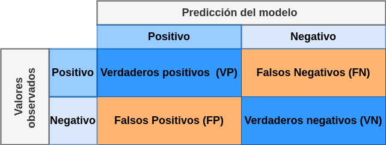

```{r setup, include=FALSE}
knitr::opts_chunk$set(echo = TRUE, comment = NA)

# colores
c1="#FF7F00"
c2="#=EB0C6"
c3="#034A94"
c4="#686868"

```


<br/><br/>

A continuación se presentan los problemas relacionados en los tutoriales 301 que en algunos casos han presentado problemas en el momento de su instalación

### **paquetes requeridos**

<pre>
library(learnr)
library(paqueteMOD)
library(boot)
library(ggplot2)
library(gridExtra)
library(knitr)
library(broom)
library(stargazer)
library(dplyr)
library(ROSE)
</pre>  


#### **PRESENTACIÓN**

```{r, echo=FALSE, out.width="100%", fig.align = "center"}
knitr::include_graphics("img/banner2.png")
```


El presente tutorial contiene preguntas relacionadas con l estimación del modelo y sus supuestos, conceptos importante para la compresión los proceso relacionados con la inferencia realizada sobre los resultados obtenidos por el método de MCO.   

</br>
  
#### **CONCEPTOS**
  
#### **Modelo de Diseño de Experimentos**

<div class="content-box-blue">
$$ 
 Y  = \alpha_{0} +\alpha_{1} X_1 +\alpha_{2} X_2 + \dots +\alpha_{k} X_k  + \varepsilon
$$
</div>

</br>

Donde la variable dependiente $Y$ es una variable cuantitativa, mientras que las variables independientes $X_1, X_2, \dots$ corresponden a  variables cualitativas con valores que permiten dividir la variable $Y$ en subgrupos, llamados **tratamientos** que a su vez presentan categorías llamados **niveles**. 

</br>

#### **Modelo Logit**

<div class="content-box-blue">
$$
Y = \beta_{0} + \beta_{1}X_{1} + \dots + \beta_{k} X_{k} + \varepsilon
$$
</div>

</br>

Donde la variable dependiente $Y$ es una variable binaria que toma dos posibles valores ($R_X =\{0,1\}$) en caso del modelo binomial  y más de dos valores ($R_X =\{0,1,2,\dots\}$) en el caso multinomial.

Predice la probabilidad de que ocurra el evento mediante la combinación lineal de una o más variables independientes, para lo cual utiliza la trasnformación la función **logitica**.

El modelo se transforma a través de la razón de probabilidades $Odds$ Ratio y se linealiza aplicando la función logarítmica.

$$\Bigg(\dfrac{P(Y=k|X=x)}{1-P(Y=k|X=x)}\Bigg) =  \exp{\Big\{\beta_{0}+ \beta_{1} \hspace{.2cm}x_{i} \Big\}} + \varepsilon_{i}^{*}$$
$$\ln \Bigg(\dfrac{P(Y=k|X=x)}{1-P(Y=k|X=x)}\Bigg) =  \beta_{0}+ \beta_{1} \hspace{.2cm}x_{i} + \varepsilon_{i}^{*}$$
De esta forma se puede dá solución al sistema lineal, mediante el método de máxima verosimilitud
<pre>
glm(formula = honor ~ matematicas, 
               family = binomial(link = "logit"),
               data = matriculah)
</pre>

Para evaluar el modelo: 

* Se parte en dos la data 
  + data.train 60% a 80%)
  + data.test

* Se estima el modelo con la data.train

* Se evalua el resultado con la data.test, utilizando la matriz de confusión

</br></br>

#### **Matriz de confisión**


```{r, echo=FALSE, out.width="60%", fig.align = "center"}

```

</br></br>

#### **Indicadores de evaluación**

</br>


* **Exactitud** = $\frac{(VP + VN)}{\text{Total}}$                                
                                                                   
* **Tasade_Error** = $\dfrac{(FP + FN)}{\text{Total}}$                              
                                                                   
* **Sensibilidad** = $\dfrac{VP}{\text{Total positivos}}$                            
                                                                   
* **Especificidad** = $\dfrac{VN/}{\text{Total negativos}}$                            
                                                                   
* **Precisión** = $\dfrac{VP}{\text{Total positivos pronosticados}}$                  
                                                                   
* **Valor predicción negativo** = $\dfrac{VN}{\text{Total negativos pronosticados}}$


</br></br>


#### **CÓDIGO R**

##### **Estimación del modelo de diseño**
<pre>
modelo_d=glm(y ~ x1 + x2 , data=datos)
summary(modelo_d)
</pre>

</br></br>

##### **Estimación del modelo logit**
<pre>
library(tidyverse)
matriculah %>% 
glm(y ~ x1 + x2, family = binomial(link = "logit"), data = .) -> modelo 
</pre>

</br></br>

##### **Evaluación del modelo**

###### **Partición de la data**

<pre>  
ntrain <- nrow(matriculah)*0.6
ntest <- nrow(matriculah)*0.4

set.seed(123)
index_train<-sample(1:nrow(matriculah),size = ntrain)
train<-matriculah[index_train,]  # muestra de entrenamiento
test<-matriculah[-index_train,]  # muestra de prueba
</pre>

</br></br>

##### **Estimación del modelo con data.train**

<pre>
glm(honor ~ matematicas , family = binomial(link = "logit"), data = train) -> modelo2  
</pre>  

</br></br>

##### **Construcción de pronósticos con la data.test**
  
<pre>
library(tidyverse)
valor_pronosticado <- predict(modelo2,test,type = "response")
niveles_pronosticados <- ifelse(valor_pronosticado >0.5, "Si","No") %>%
                             factor(.)
</pre>

</br></br>

##### **Construcción de matriz de confusión**

<pre>  
rendimiento_data<-data.frame(observados=test$honor,
                             predicciones= niveles_pronosticados)

Positivos <- sum(rendimiento_data$observados=="Si")
Negativos <- sum(rendimiento_data$observados=="No")
Positivos_pronosticados <- sum(rendimiento_data$predicciones=="Si")
Negativos_pronosticados <- sum(rendimiento_data$predicciones=="No")
Total <- nrow(rendimiento_data)
VP<-sum(rendimiento_data$observados=="Si" & rendimiento_data$predicciones=="Si")
VN<-sum(rendimiento_data$observados=="No" & rendimiento_data$predicciones=="No")
FP<-sum(rendimiento_data$observados=="No" & rendimiento_data$predicciones=="Si")
FN<-sum(rendimiento_data$observados=="Si" & rendimiento_data$predicciones=="No")

matriz_confusion=matrix(c(VP, FP, FN,VN), nrow=2)

rownames(matriz_confusion) = c(" Si ", " No    ")
colnames(matriz_confusion) = c("Si", "No")
matriz_confusion  
</pre>  
  
</br></br>  
  
##### **Construcción indicadores**

<pre>
Exactitud <- (VP+VN)/Total
Tasa_de_Error <- (FP+FN)/Total
Sensibilidad <- VP/Positivos
Especificidad <- VN/Negativos
Precision <- VP/Positivos_pronosticados
Valor_prediccion_negativo <- VN / Negativos_pronosticados

indicadores <- t(data.frame(Exactitud,
                            Tasa_de_Error,
                            Sensibilidad,
                            Especificidad,
                            Precision,
                            Valor_prediccion_negativo))

colnames(indicadores)="indicadores" 
rownames(indicadores) =c("Exactitud ", 
                         "Tasa de Error ", 
                         "Sensibilidad", 
                         "Especificidad", 
                         "Precisión", 
                         "Valor predicción negativo")
indicadores                         
</pre>

</br></br>  

##### **Balanceo de datos**

<pre>
library(ROSE)
# oversampling
train_blc <- ovun.sample(rotacion~., data=train, 
                         p=0.5, seed=1, 
                         method="over")$data

test_blc <- ovun.sample(rotacion~., data=test, 
                         p=0.5, seed=1, 
                         method="over")$data
</pre>

</br></br>  


</br></br> </br></br> 

## **PROBLEMAS**

</br></br> 

### <span style="color:#FF7F00">**Problema 1**</span>

Para la base de datos `rotacion` contenida en `paqueteMOD` y  seleccione una nueva data que contenga solo  las 5 primera variables . Valide el resultado obtenido


```{r}
library(paqueteMOD)
data("rotacion")
datos <- rotacion[, c(1,2,3,4,5)]
summary(datos)
```

</br></br> 

### <span style="color:#FF7F00">**Problema 2**</span>

La siguiente información presenta la descripción de base de `datos` contenida en `paqueteMOD` tiene  1470 registros y 5 variables. 

Cambie el nombre de las variables por:   

* rotacion
* edad
* viaje.negocios_
* departamento_
* distancia.casa

<pre>
Rows: 1,470
Columns: 5
$ rotacion       <chr> "Si", "No", "Si", "No", "No", "No", "No", "No", "No", "No", "No", "No", "No", "No", "Si", "…
$ edad           <dbl> 41, 49, 37, 33, 27, 32, 59, 30, 38, 36, 35, 29, 31, 34, 28, 29, 32, 22, 53, 38, 24, 36, 34,…
$ viaje.negocios <chr> "Raramente", "Frecuentemente", "Raramente", "Frecuentemente", "Raramente", "Frecuentemente"…
$ departamento   <chr> "Ventas", "IyD", "IyD", "IyD", "IyD", "IyD", "IyD", "IyD", "IyD", "IyD", "IyD", "IyD", "IyD…
$ Ddstancia.casa <dbl> 1, 8, 2, 3, 2, 2, 3, 24, 23, 27, 16, 15, 26, 19, 24, 21, 5, 16, 2, 2, 11, 9, 7, 15, 6, 5, 1…
</pre>


```{r}
library(paqueteMOD)
data("datosR")
names(datosR) = c("rotacion", "edad", "viaje.negocios_", "departamento_", "distancia.casa")
names(datosR)
```

</br></br> 

### <span style="color:#FF7F00">**Problema 3**</span>

La base de `datosR` contenida en `paqueteMOD` tiene  1470 registros y 5 variables. 

* `rotacion` : si el empleado 
* `edad`
* `viaje.negocios_`
* `departamento_`
* `distancia.casa`

Estime un primer modelo (modelo1) que permita determinar la probabilidad de que un empleado rote (cambie de puesto) en la empresa en función de las variables disponibles en la base `datosR`.


```{r}
library(paqueteMOD)
data("datosR")
names(datosR) <- c("rotacion", "edad", "viaje.negocios_", "departamento_", "distancia.casa")
datosR$rotacion <- factor(datosR$rotacion)
modelo1 <- 
  glm(rotacion ~ edad + viaje.negocios_ + departamento_ + distancia.casa, family = binomial(link = "logit"), data = datosR)
summary(modelo1)
```


</br></br> 

### <span style="color:#FF7F00">**Problema 4**</span>

Verifique la significancia global del modelo, es decir la validez del modelo 

$H_0 : \beta_{1} = \beta_{2} = \beta_{3} = \dots = \beta_{6} =0$
$H_{a} : \text{algún} \hspace{.3cm}\beta_{i} \neq 0$


<pre>
Call:
glm(formula = rotacion ~ edad + viaje.negocios_ + departamento_ + 
    distancia.casa, family = binomial(link = "logit"), data = datosR)

Deviance Residuals: 
    Min       1Q   Median       3Q      Max  
-1.2660  -0.6344  -0.5051  -0.3523   2.5930  

Coefficients:
                          Estimate Std. Error z value Pr(>|z|)    
(Intercept)               0.356061   0.352494   1.010 0.312438    
edad                     -0.053292   0.008894  -5.992 2.08e-09 ***
viaje.negocios_No_Viaja  -1.407973   0.336746  -4.181 2.90e-05 ***
viaje.negocios_Raramente -0.645887   0.168069  -3.843 0.000122 ***
departamento_RH           0.429838   0.346728   1.240 0.215087    
departamento_Ventas       0.478018   0.154091   3.102 0.001921 ** 
distancia.casa            0.027120   0.008632   3.142 0.001679 ** 
---
Signif. codes:  0 ‘***’ 0.001 ‘**’ 0.01 ‘*’ 0.05 ‘.’ 0.1 ‘ ’ 1

(Dispersion parameter for binomial family taken to be 1)

    Null deviance: 1298.6  on 1469  degrees of freedom
Residual deviance: 1215.6  on 1463  degrees of freedom
AIC: 1229.6

Number of Fisher Scoring iterations: 5
</pre>


```{r}
library(paqueteMOD)
data("datosR")
names(datosR) = c("rotacion", "edad", "viaje.negocios_", "departamento_", "distancia.casa")
datosR$rotacion = factor(datosR$rotacion)
modelo1 = 
  glm(rotacion ~ edad + viaje.negocios_ + departamento_ + distancia.casa, family = binomial(link = "logit"), data = datosR)
estadistico_X2 = modelo1$null.deviance - modelo1$deviance
gl = modelo1$df.null - modelo1$df.residual
valorp = 1 - pchisq(estadistico_X2, df = gl)
valorp
```

</br></br> 

### <span style="color:#FF7F00">**Problema 5**</span>

La base de `datosR` contenida en `paqueteMOD` tiene  1470 registros y 5 variables. 

* `rotacion` : si el empleado 
* `edad`
* `viaje.negocios_`
* `departamento_`
* `distancia.casa`

Para el proceso de medir la validéz del modelo se debe segmentar la data en dos partes (train y test) que permitan construir la matriz de confusión para el modelo1

<pre>
glm(formula = rotacion ~ edad + viaje.negocios_ + departamento_ + 
    distancia.casa, family = binomial(link = "logit"), data = datosR)
</pre>

Segmente la base datosR en dos partes (60%-40%) y verifique si las bases estan balanceadas


```{r }
library(paqueteMOD)
data("datosR")
names(datosR) = c("rotacion", "edad", "viaje.negocios_", "departamento_", "distancia.casa")
datosR$rotacion = factor(datosR$rotacion)

ntrain <- nrow(datosR)*0.6
ntest <- nrow(datosR)*0.4

set.seed(123)
index_train <- sample(1:nrow(datosR),size = ntrain)
train_dat <- datosR[index_train,]  # muestra de entrenamiento
test_dat <- datosR[-index_train,]  # muestra de prueba  
prop.table(table(train_dat$rotacion))
```

</br></br> 

### <span style="color:#FF7F00">**Problema 6**</span>

Los siguientes cálculos indican que tanto la base `train` como la base `test` se encuentran desbalanceadas, lo cual afectará las estimaciones del modelo. 

Realice un procedimiento que permita el balace los dos opciones en las bases de datos.

<pre>
table(test$rotacion) %>% pro.table()

       No        Si 
0.8316327 0.1683673 
 
table(train$rotacion) %>%   prop.table()
       No        Si 
0.8435374 0.1564626 
</pre>


**Nota** : A continuación se presenta el código de la solución a la pregunta, debido a que dentro de ella se utiliza la función `ovun.sample()` del paquete `ROSE`,  la cual genera un objeto por fuera del ambiente del tutorial, generando así un error en su ejecución.

Copie el código en un Script de R o dentro de un bloque de Rmd y podrá visualizar el resultado requerido

</br></br>


```{r}
library(paqueteMOD)
data("datosR")   ## carga los datos
names(datosR) = c("rotacion", 
                   "edad", 
                   "viaje.negocios_", 
                   "departamento_", 
                   "distancia.casa")  # cambio de los nombre de las variables
datosR$rotacion = factor(datosR$rotacion) # cambio a factor de la variable dependiente

ntrain <- nrow(datosR)*0.6     # n para la muestra train 
ntest <- nrow(datosR)*0.4      # n para la muestra test    

set.seed(123)  # control de la generación de aleatorio
index_train <- sample(1:nrow(datosR),size = ntrain) # indice aleatorio 
train_dat <- datosR[index_train,]  # muestra de entrenamiento 
test_dat <- datosR[-index_train,]  # muestra de prueba  

# balanceo de muestas mediante la técnica oversampling
train_blc <- ROSE::ovun.sample(rotacion~edad + viaje.negocios_ + departamento_ + distancia.casa, data = train_dat, 
                         p = 0.5, seed = 1, 
                         method = "over")$data

test_blc <- ROSE::ovun.sample(rotacion~ edad + viaje.negocios_ + departamento_ + distancia.casa, data = test_dat, 
                         p = 0.5, seed = 1, 
                         method = "over")$data

prop.table(table(test_blc$rotacion)) 
prop.table(table(train_blc$rotacion))
```

</br></br> 

### <span style="color:#FF7F00">**Problema 7**</span>

Realice la estimación y la determine la capacidad discriminante del modelo a partir de las bases balanceadas

**Nota** : A continuación se presenta el código de la solución a la pregunta, debido a que dentro de ella se utiliza la función `ovun.sample()` del paquete `ROSE`,  la cual genera un objeto por fuera del ambiente del tutorial, generando así un error en su ejecución.

Copie el código en un Script de R o dentro de un bloque de Rmd y podrá visualizar el resultado requerido

</br></br>


```{r}
library(paqueteMOD)
library(ROSE)
data("datosR")
names(datosR) = c("rotacion", "edad", "viaje.negocios_", "departamento_", "distancia.casa")
datosR$rotacion = factor(datosR$rotacion)

ntrain <- nrow(datosR)*0.6
ntest <- nrow(datosR)*0.4

set.seed(123)
index_train <- sample(1:nrow(datosR),size = ntrain)
train_dat <- datosR[index_train,]  # muestra de entrenamiento
test_dat <- datosR[-index_train,]  # muestra de prueba

assign("train_data", train_dat, envir = parent.frame())
assign("test_data", test_dat, envir = parent.frame())

# oversampling -----
train_blc <- ovun.sample(rotacion ~., data = train_dat, 
                         p = 0.5, seed = 1, 
                         method = "over")$data

test_blc <- ovun.sample(rotacion~., data = test_dat, 
                         p = 0.5, seed = 1, 
                         method = "over")$data

modelo2 =  glm(rotacion ~ edad + viaje.negocios_ + departamento_ + distancia.casa, 
              family = binomial(link = "logit"), data = train_blc)

# matriz de confusión ----
valor_prnt.blc <- predict(modelo2,test_blc,type = "response")
niveles_prnt.blc <- ifelse(valor_prnt.blc > 0.5, "Si","No") 
niveles_prnt.blc <-factor(niveles_prnt.blc)

# construcción de indicadores ----
rendimiento_data <- data.frame(observados = test_blc$rotacion,
                             predicciones = niveles_prnt.blc)

Positivos <- sum(rendimiento_data$observados == "Si")
Negativos <- sum(rendimiento_data$observados == "No")
Positivos_pronosticados <- sum(rendimiento_data$predicciones == "Si")
Negativos_pronosticados <- sum(rendimiento_data$predicciones == "No")
Total <- nrow(rendimiento_data)
VP <- sum(rendimiento_data$observados == "Si" & rendimiento_data$predicciones == "Si")
VN <- sum(rendimiento_data$observados == "No" & rendimiento_data$predicciones == "No")
FP <- sum(rendimiento_data$observados == "No" & rendimiento_data$predicciones == "Si")
FN <- sum(rendimiento_data$observados == "Si" & rendimiento_data$predicciones == "No")

matriz_confusion = matrix(c(VP, FP, FN,VN), nrow = 2)

rownames(matriz_confusion) = c(" Si ", " No    ")
colnames(matriz_confusion) = c("Si", "No")
matriz_confusion


```


</br></br>

### <span style="color:#FF7F00">**Problema 8**</span>

Finalmente estime los indicadores para el modelo 2 estimado con las bases balanceadas


**Nota** : A continuación se presenta el código de la solución a la pregunta, debido a que dentro de ella se utiliza la función `ovun.sample()` del paquete `ROSE`,  la cual genera un objeto por fuera del ambiente del tutorial, generando así un error en su ejecución.

Copie el código en un Script de R o dentro de un bloque de Rmd y podrá visualizar el resultado requerido

</br></br>


```{r}
library(paqueteMOD)
library(tidyverse)
library(ROSE)
data("datosR")
names(datosR) = c("rotacion", "edad", "viaje.negocios_", "departamento_", "distancia.casa")
datosR$rotacion = factor(datosR$rotacion)

ntrain <- nrow(datosR)*0.6
ntest <- nrow(datosR)*0.4

set.seed(123)
index_train <- sample(1:nrow(datosR),size = ntrain)
train_dat <- datosR[index_train,]  # muestra de entrenamiento
test_dat <- datosR[-index_train,]  # muestra de prueba

assign("train_data", train_dat)
assign("test_data", test_dat)

# oversampling ----
train_blc <- ovun.sample(rotacion ~., data = train_dat, 
                         p = 0.5, seed = 1, 
                         method = "over")$data

test_blc <- ovun.sample(rotacion ~., data = test_dat, 
                         p = 0.5, seed = 1, 
                         method = "over")$data

assign("train_blc", train_blc)
assign("test_blc", test_blc)

modelo2 =  glm(rotacion ~ edad + viaje.negocios_ + departamento_ + distancia.casa, 
              family = binomial(link = "logit"), data = train_blc)

# matriz de confusión -----
valor_prnt.blc <- predict(modelo2,test_blc,type = "response")
niveles_prnt.blc <- ifelse(valor_prnt.blc > 0.5, "Si","No") 
niveles_prnt.blc <-factor(niveles_prnt.blc)

rendimiento_data <- data.frame(observados = test_blc$rotacion,
                             predicciones = niveles_prnt.blc)
Positivos <- sum(rendimiento_data$observados == "Si")
Negativos <- sum(rendimiento_data$observados == "No")
Positivos_pronosticados <- sum(rendimiento_data$predicciones == "Si")
Negativos_pronosticados <- sum(rendimiento_data$predicciones == "No")
Total <- nrow(rendimiento_data)
VP <- sum(rendimiento_data$observados == "Si" & rendimiento_data$predicciones == "Si")
VN <- sum(rendimiento_data$observados == "No" & rendimiento_data$predicciones == "No")
FP <- sum(rendimiento_data$observados == "No" & rendimiento_data$predicciones == "Si")
FN <- sum(rendimiento_data$observados == "Si" & rendimiento_data$predicciones == "No")

matriz_confusion = matrix(c(VP, FP, FN,VN), nrow = 2)

rownames(matriz_confusion) = c(" Si ", " No    ")
colnames(matriz_confusion) = c("Si", "No")
matriz_confusion

# construcción de indicadores -----
Exactitud <- (VP + VN)/Total
Tasa_de_Error <- (FP + FN)/Total
Sensibilidad <- VP/Positivos
Especificidad <- VN/Negativos
Precision <- VP/Positivos_pronosticados
Valor_prediccion_negativo <- VN / Negativos_pronosticados

indicadores <- t(data.frame(Exactitud,Tasa_de_Error,Sensibilidad,Especificidad,Precision,Valor_prediccion_negativo))

colnames(indicadores) = "indicadores" 
rownames(indicadores) = c("Exactitud ", 
                         "Tasa de Error ", 
                         "Sensibilidad", 
                         "Especificidad", 
                         "Precisión", 
                         "Valor predicción negativo")
 round(indicadores,3) 

```


